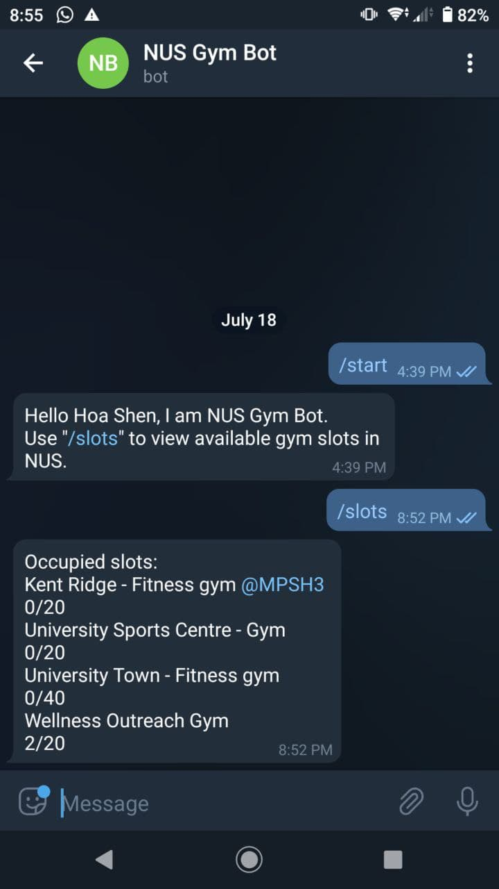

# NUS Gym Bot

Nus Gym Bot is a telegram bot that retrieves the number of currently available slots for gyms in NUS.

Feel free to use it for yourselves, after cloning you will need to add a data.json file that contains:
1. Your telegram API token
2. The path to your chromedriver executable 
3. NUSNET ID
4. NUS password

 { width: 100px; }
